# 🏦 Bank Customer Risk Analysis and Prediction System

This project is an end-to-end machine learning system that predicts whether bank customers will default on their credit card or loan payments based on their demographic characteristics and financial history.

It is a full-stack AI application powered by **XGBoost** and **FastAPI**, complete with a sleek, interactive **Web Interface** where users can instantly test customer profiles.

---

## 📸 Project Visuals

### 🖥️ Web Interface

Interactive dashboard where users can input customer data and receive instant AI analysis:

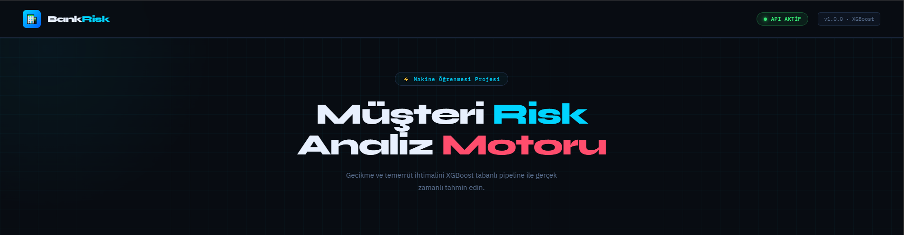
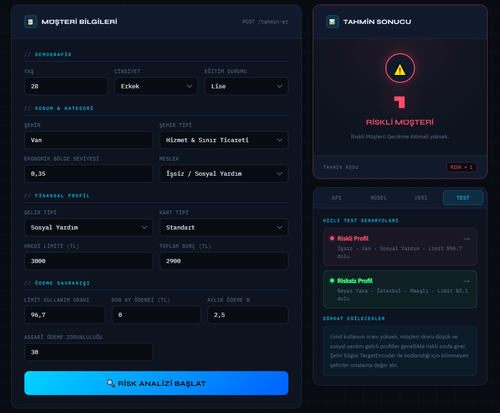
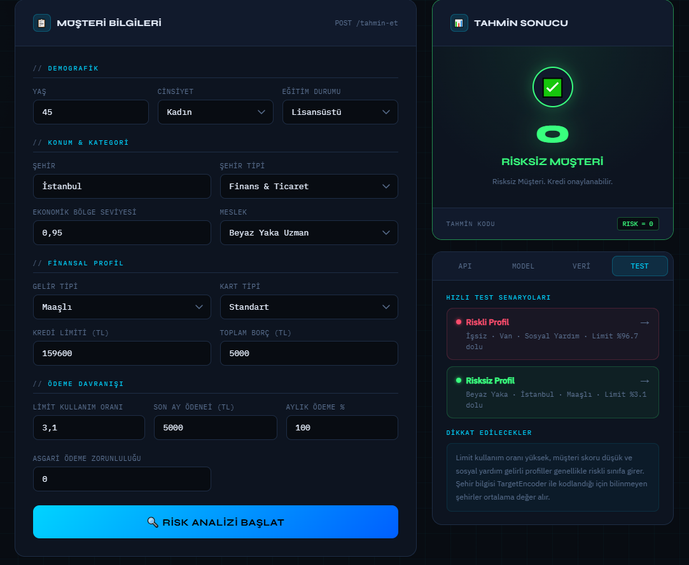
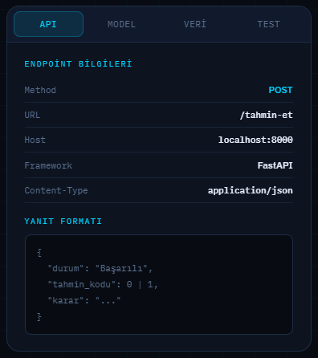
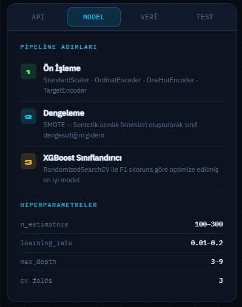
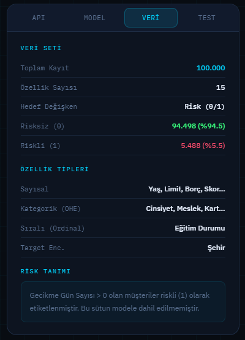
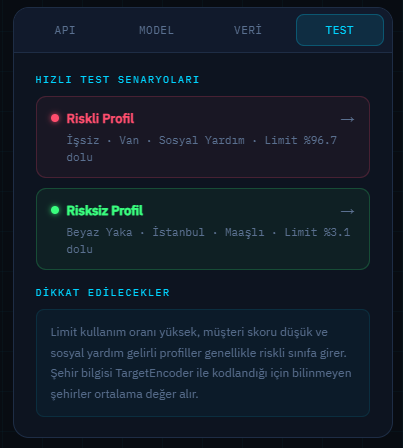

### 📊 Model Analysis Graphs

Exploratory Data Analysis (EDA) visualizations generated during model training:

**1. Feature Correlation Map**
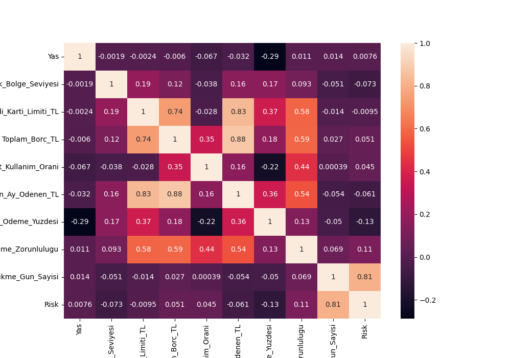

**2. Distribution by Education Level**
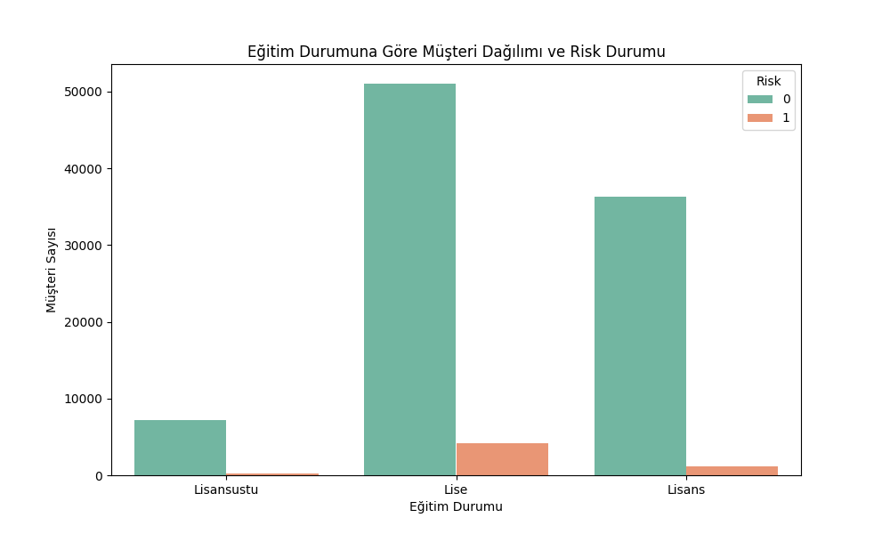

**3. Limit Usage Ratio Analysis**
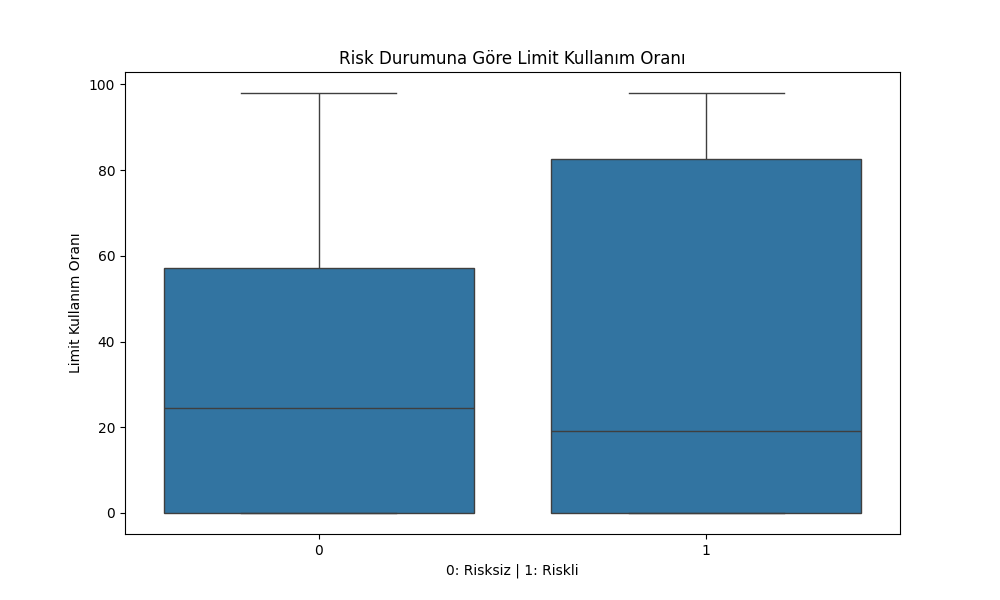

**4. Age Density by Risk Status**
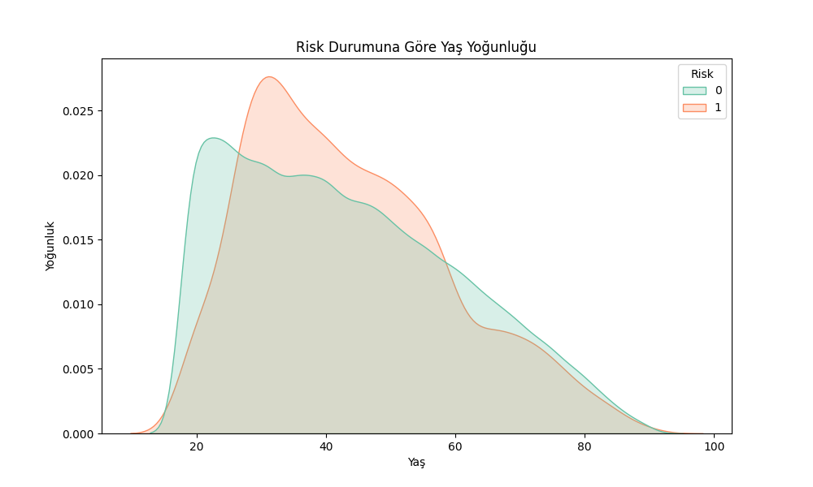

**5. Age vs. Monthly Payment Percentage**
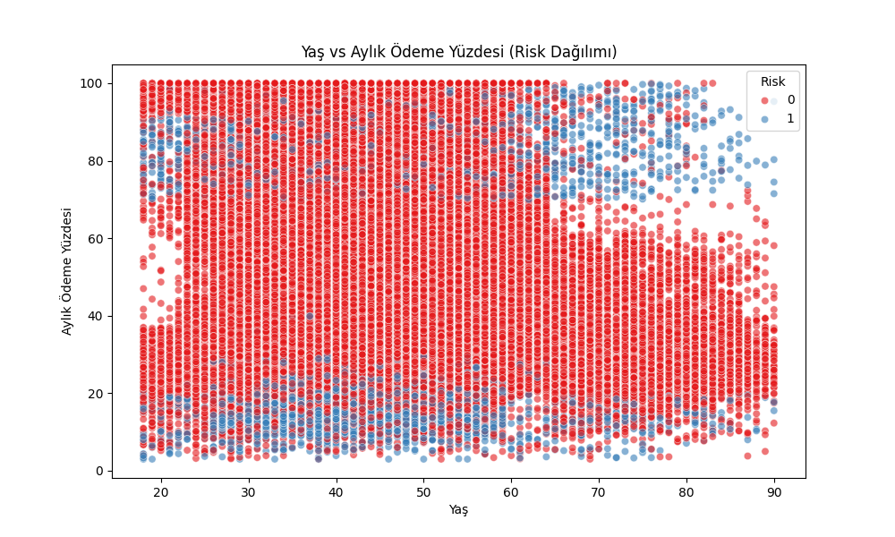

---

## 📂 File Structure

```text
bank-segmentation/
│
├── web/
│   ├── web_images/         # Interface screenshots
│   ├── index.html          # Web interface
│   ├── style.css           # Styles
│   └── app.js              # Form logic and API connection
│
├── model_graphs/           # EDA graphs generated during training
│   ├── corr.png
│   ├── education.png
│   ├── risk.png
│   ├── age.png
│   └── age_payment.png
│
├── app.py                  # Model training (EDA, pipeline, CV, hyperparameter search)
├── main.py                 # FastAPI endpoints
├── schemas.py              # Input data model (15 features)
├── bank_risk_pipeline.pkl  # Trained model (generated after running app.py)
└── requirements.txt        # Dependencies
```

---

## ⚙️ Installation

```bash
pip install -r requirements.txt
```

**requirements.txt**
```
fastapi
uvicorn
pydantic
pandas
numpy
scikit-learn==1.6.1
xgboost
imbalanced-learn
category_encoders
joblib
matplotlib
seaborn
```

---

## 🚀 Usage

```bash
# 1. Train the model
python app.py

# 2. Start the API
uvicorn main:app --reload

# 3. Open index.html in your browser
```

---

## 🔌 API

| Method | Endpoint | Description |
|--------|----------|-------------|
| `POST` | `/tahmin-et` | Submit customer data, receive risk prediction (0: Safe, 1: Risky) |
| `GET` | `/feature-importance` | Feature importance ranking |
| `GET` | `/model-info` | Model parameters |
| `GET` | `/docs` | Swagger UI |

---

## 📊 Dataset & Model

- 100,000 rows of synthetic Turkish banking data
- Target variable derived from `Gecikme_Gun_Sayisi > 0`
- Class imbalance handled with SMOTE (94.5% safe / 5.5% risky)
- Optimized with 5-Fold Cross-Validation and RandomizedSearchCV (F1 score)
- `Musteri_Skoru` and `Hesap_Aktif` columns removed due to data leakage
